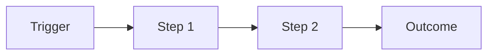

# Discovery

**Goal:** Understand the business problem, users, data landscape, and constraints before committing to a solution shape.

**Done when:** You can write a one-page problem statement the customer agrees with, and you have a rough data source inventory.

---

## Stakeholder map

| Name | Role | Influence | Interest | Notes |
|------|------|-----------|----------|-------|
| | Executive sponsor | H / M / L | H / M / L | |
| | Domain expert | | | |
| | IT / data owner | | | |
| | End user rep | | | |

## User personas

### Persona 1: {{NAME}}

| Attribute | Detail |
|-----------|--------|
| Job title | |
| Daily workflow | |
| Decisions they make | |
| Current tools | |
| Foundry app(s) they'll use | |

## Discovery questions

### Business & workflow

- [ ] What decision or action does this workflow enable?
- [ ] What happens if this workflow is wrong or slow?
- [ ] Who is accountable for the outcome?
- [ ] What is the volume / frequency of this workflow?
- [ ] Are there regulatory or audit requirements?

### Data

- [ ] What systems hold the source data?
- [ ] Who owns each source system?
- [ ] How fresh does data need to be (batch vs near-real-time)?
- [ ] What is the data quality like today?
- [ ] Are there PII / PHI / export control concerns?
- [ ] Existing exports, APIs, or file drops available?

### Technical environment

- [ ] Foundry enrollment details (region, SSO, network egress)
- [ ] Existing Foundry usage (ontology, pipelines, apps)?
- [ ] Integration requirements (external systems, webhooks)?
- [ ] Environments needed (dev / staging / prod)?

### Organizational

- [ ] Who approves ontology changes?
- [ ] Who will maintain this after FDE leaves?
- [ ] Training expectations?
- [ ] Change management / rollout plan?

## Data source inventory

| Source | System | Owner | Format | Refresh | Sensitivity | Access status |
|--------|--------|-------|--------|---------|-------------|---------------|
| | | | API / DB / File | | | Not started / In progress / Ready |

## Current-state workflow (as-is)

Describe in prose:

## Competitive / alternative solutions considered

| Option | Pros | Cons | Why not chosen |
|--------|------|------|----------------|
| Status quo | | | |
| Point solution | | | |
| Foundry | | | |

## Discovery notes

_Raw notes from interviews, workshops, shadowing sessions._

---

## Exit criteria checklist

- [ ] Problem statement drafted and reviewed with sponsor
- [ ] At least one end-user interview completed
- [ ] Data source inventory started (even if incomplete)
- [ ] Known constraints documented (timeline, security, integrations)
- [ ] Rough solution hypothesis recorded (not committed yet)
