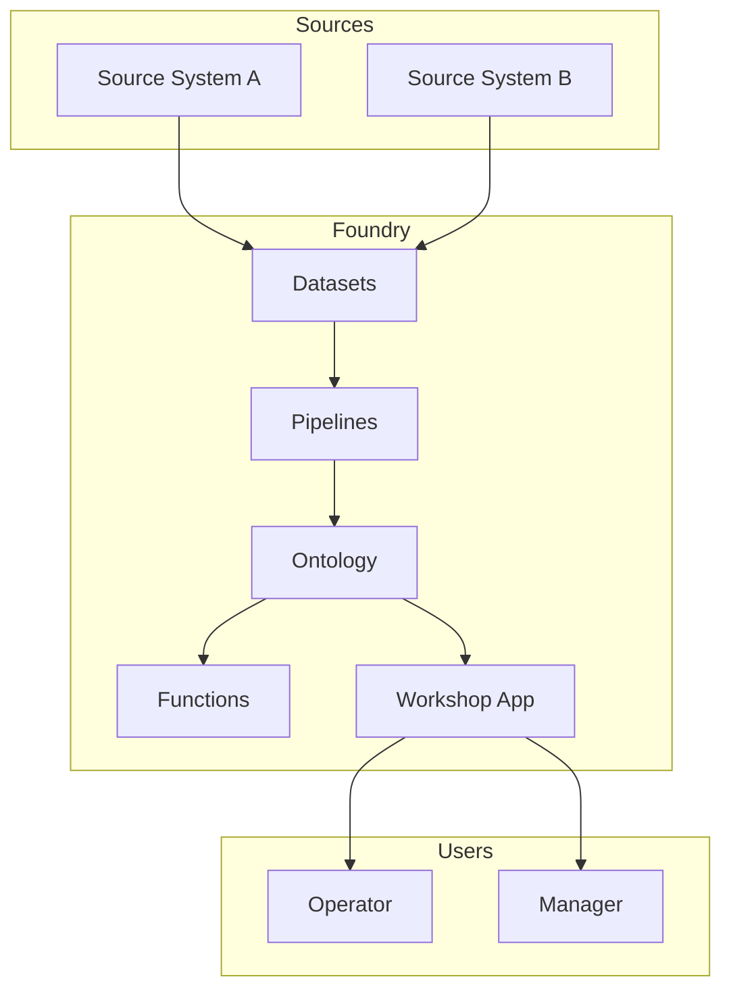

# Design Overview

**Goal:** Define the ontology, data flows, and application experience before writing production code.

**Done when:** Design review completed with customer and internal reviewers; ADRs recorded for key decisions.

---

## Architecture diagram

## Design documents

| Document | Status | Link |
|----------|--------|------|
| [Ontology design](ontology-design.md) | Draft / Review / Approved | |
| [Pipeline design](pipeline-design.md) | Draft / Review / Approved | |
| [Workshop spec](workshop-spec.md) | Draft / Review / Approved | |
| [Security & permissions](security-permissions.md) | Draft / Review / Approved | |

## Key design decisions

| # | Decision | ADR | Status |
|---|----------|-----|--------|
| 1 | | [ADR-001](adrs/adr-001-template.md) | |
| 2 | | | |

## Design review

| Reviewer | Role | Date | Feedback |
|----------|------|------|----------|
| | Customer domain lead | | |
| | Palantir reviewer | | |
| | Security | | |

## Open design questions

| Question | Options | Owner | Resolve by |
|----------|---------|-------|------------|
| | | | |

---

## Exit criteria checklist

- [ ] Ontology object/link types defined with property list
- [ ] Primary user workflows mapped to Workshop modules
- [ ] Pipeline inputs/outputs and refresh cadence defined
- [ ] Permissions model sketched (groups, roles, object scopes)
- [ ] ADRs written for non-obvious decisions
- [ ] Customer design sign-off obtained
