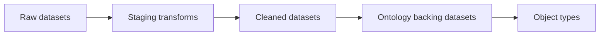

# Pipeline Design — {{ENGAGEMENT_NAME}}

**Version:** 0.1
**Last updated:** {{DATE}}

---

## Pipeline inventory

| Pipeline | Type | Schedule | Inputs | Outputs | Ontology backing |
|----------|------|----------|--------|---------|------------------|
| | Batch / Streaming / Virtual Table | Cron / Event | | Dataset / Ontology | |

---

## Data flow

---

## Per-pipeline spec

### {{pipeline_name}}

**Purpose:**

**Schedule:** `0 6 * * *` (example)

**Inputs:**

| Dataset / Source | Schema highlights | Volume | Freshness SLA |
|------------------|-------------------|--------|---------------|
| | | | |

**Transform logic (summary):**

1.
2.
3.

**Outputs:**

| Output | Schema | Downstream consumers |
|--------|--------|---------------------|
| | | |

**Data quality checks:**

| Check | Rule | On failure |
|-------|------|------------|
| Row count | Within ±10% of prior run | Alert / Halt |
| Null rate on {{col}} | < 1% | Alert |
| PK uniqueness | No duplicates | Halt |

**Error handling:**

- Retries:
- Alerting channel:
- Manual rerun procedure:

---

## Lineage & ownership

| Dataset | Owner | Retention | Classification |
|---------|-------|-----------|----------------|
| | FDE / Customer | | Public / Internal / Restricted |

---

## Build checklist

- [ ] Inputs registered in Foundry with correct markings
- [ ] Transforms in Code Repository with tests
- [ ] Schedules configured with appropriate compute profile
- [ ] Health checks / monitoring alerts set up
- [ ] Lineage documented in Compass
- [ ] Backfill plan documented (if historical load)
