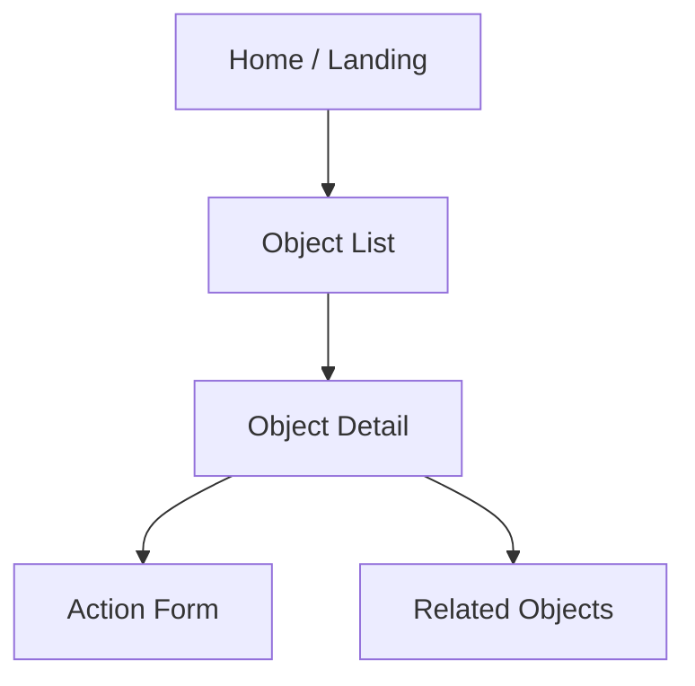

# Workshop Application Spec — {{APP_NAME}}

**Version:** 0.1
**Last updated:** {{DATE}}
**Primary users:** {{PERSONAS}}

---

## App purpose

> What can a user accomplish in this app that they couldn't before?

## Module map

| Module | Type | Purpose | Primary object type(s) |
|--------|------|---------|------------------------|
| | Object Table / Object View / Map / Chart / ... | | |

---

## Per-module spec

### {{Module Name}}

**Layout:**

**Data:**

| Widget | Object type | Filter / sort | Notes |
|--------|-------------|---------------|-------|
| | | | |

**Actions exposed:**

| Action | Trigger | Permissions |
|--------|---------|-------------|
| | Button / Inline | |

**Variables / state:**

| Variable | Scope | Purpose |
|----------|-------|---------|
| | App / Module | |

**Edge cases:**

-

---

## Navigation & UX

| Flow | Steps | Empty state | Error state |
|------|-------|-------------|-------------|
| Primary workflow | | | |

## Permissions

| Role | Modules visible | Actions allowed |
|------|-----------------|-----------------|
| | | |

---

## Non-Workshop surfaces (if any)

| Surface | Purpose | Link |
|---------|---------|------|
| Quiver analysis | | |
| Slate report | | |
| Notepad doc | | |

---

## UAT scenarios

| # | Scenario | Steps | Expected result |
|---|----------|-------|-----------------|
| 1 | | | |
